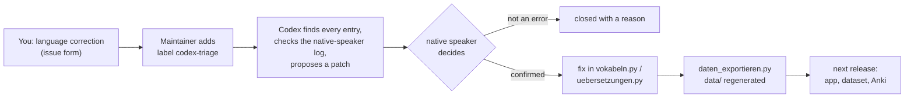

# Contributing to Zmaj

Hvala – thank you for helping. There are three ways in, from no git at all to
a pull request.

## 1. Correct the language (no git needed)



This is what Zmaj needs most. Bosnian content is reviewed by a native
speaker, but the seven non-German translations (English, Turkish, Swedish,
Dutch, Norwegian, Danish, French) were machine-translated and AI-reviewed and
**still need native speakers**.

Open a [language correction](https://github.com/zmaj-lernapp/zmaj/issues/new?template=language_correction.yml):
what the app says, what it should say, where. That is all. "My family says it
this way" is a valid reason; regional variants are welcome when real people
use them.

After two merged corrections in a language you can become its reviewer
(see [GOVERNANCE.md](GOVERNANCE.md)).

## 2. Report a bug or an idea

Use the [issue forms](https://github.com/zmaj-lernapp/zmaj/issues/new/choose).
Please never attach a backup file from the app: it contains your learning
progress.

## 3. Send a pull request

```bash
git clone https://github.com/zmaj-lernapp/zmaj.git && cd zmaj
python3 -m pip install -r requirements-dev.txt   # only for the tests
python3 start.py                                 # http://localhost:8000, ?alle=1 unlocks all levels
python3 -m pytest                                # ~2 seconds
```

Before you open the PR:

- [ ] `python3 -m pytest` and `ruff check .` pass.
- [ ] If you changed content, run `python3 daten_exportieren.py` and commit `data/`.
- [ ] You did **not** change the German meaning (`de`) of an existing word in
      `vokabeln.py`, or you say so in the PR: it is the word's ID and changing
      it resets that word for every learner. Translation fixes go into
      `uebersetzungen.py`.
- [ ] Bosnian text is Ijekavian (*mlijeko*, not *mleko*) and not "corrected"
      against an entry in `WORTSCHATZ_KORREKTUREN.md`.
- [ ] No new network access in `web/index.html`: no CDN, no analytics.

[AGENTS.md](AGENTS.md) explains these rules in more detail; it is written for
coding agents but is the best short guide for humans too. Every PR gets an
automated Codex review against it; a maintainer makes the decision.

### Where things are

| You want to change | Edit |
|---|---|
| a Bosnian word or its German meaning | `vokabeln.py` |
| a translation of a word, sentence or story | `uebersetzungen.py` |
| a button or message in the interface | `sprachen.py` (all eight languages) |
| a grammar lesson | `grammatik.py` |
| a story | `geschichten.py` |
| how the app behaves | `web/index.html` |

Identifiers and code comments are in German; you may write in English. Keep
the habit of explaining *why* in comments.

### Adding an interface language

See *Eine neue Sprache dazunehmen* in [ANLEITUNG.md](ANLEITUNG.md): add the
language to `SPRACHEN` in `sprachen.py`, translate `TEXTE`, add the content
translations to `uebersetzungen.py`. The tests tell you what is missing.

## Licensing of contributions

By contributing you agree that your code is licensed under AGPL-3.0-or-later
and your content (words, translations, texts, audio, images) under
CC BY-SA 4.0, as described in [REUSE.toml](REUSE.toml). No CLA.

## Conduct

Be kind; many contributors are learners or family members, not developers.
See the [Code of Conduct](CODE_OF_CONDUCT.md).
