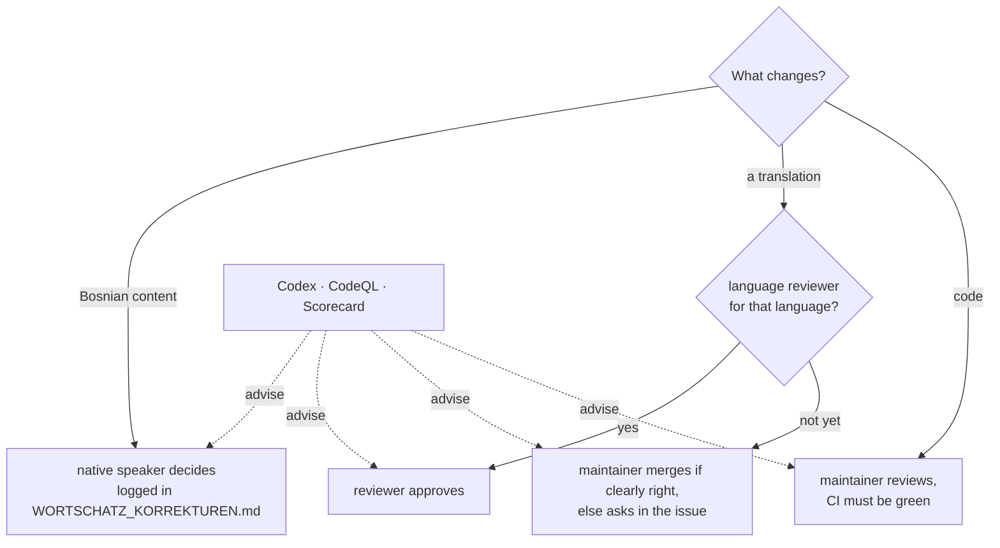

# Governance

## Roles

| Role | Who | Rights |
|---|---|---|
| Primary maintainer | Ajdin Hasic ([@zmaj-lernapp](https://github.com/zmaj-lernapp)) | merges, releases, Play Store, final say on code |
| Language reviewers | native speakers of Bosnian or of a translation language who have had corrections merged | approve content changes in their language |
| Contributors | everyone who opens an issue or a pull request | – |

## How decisions are made

- **Bosnian content:** a native speaker decides. `WORTSCHATZ_KORREKTUREN.md`
  records each ruling and overrides dictionaries, research and AI suggestions.
- **Translations:** a native speaker of that language approves the change.
  Until a language has a reviewer, the maintainer merges corrections that are
  clearly right and asks in the issue when not.
- **Code:** the maintainer reviews and merges. CI must be green.
- **Automated reviewers** (Codex, CodeQL, Scorecard) advise; a human decides.

## Becoming a language reviewer

Two merged corrections in your language and a short note in an issue are
enough. You are then listed in this file and requested as reviewer in
`.github/CODEOWNERS` for your language.

## Continuity

Everything needed to continue is in this repository: the content is
CC BY-SA 4.0 and the code AGPL-3.0, so anyone can carry the work on in a fork
if the maintainer stops. Releases of the dataset are attached to GitHub
releases so they stay downloadable either way.
