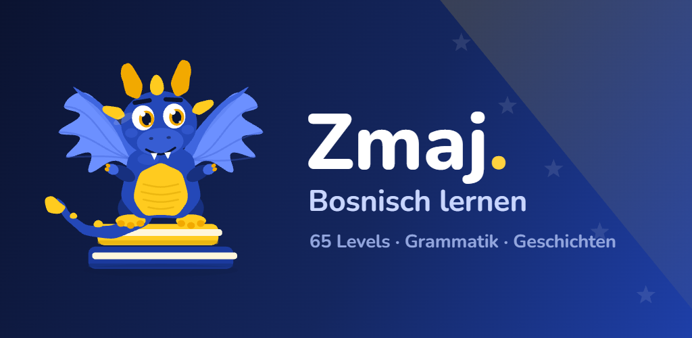
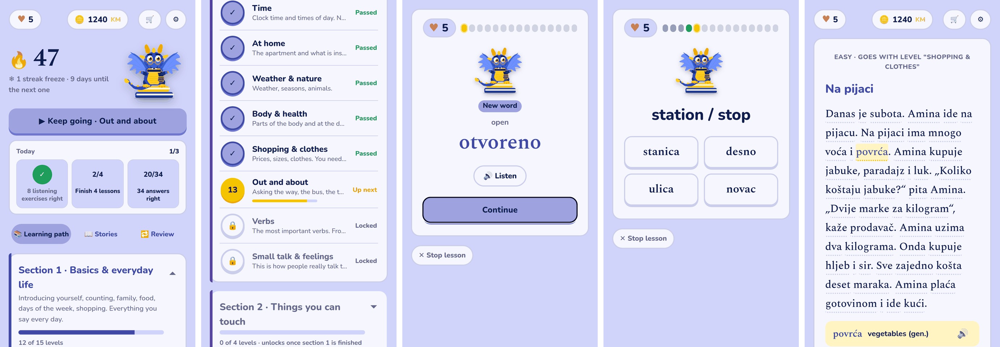
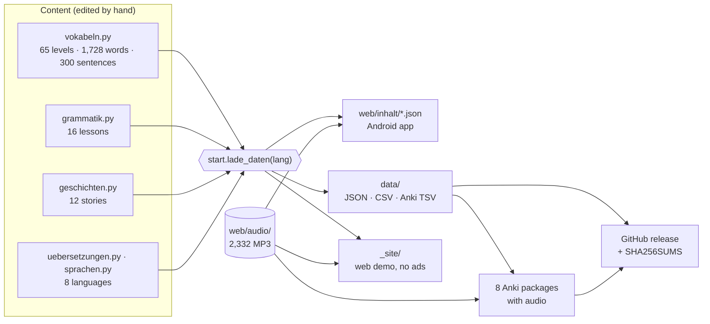
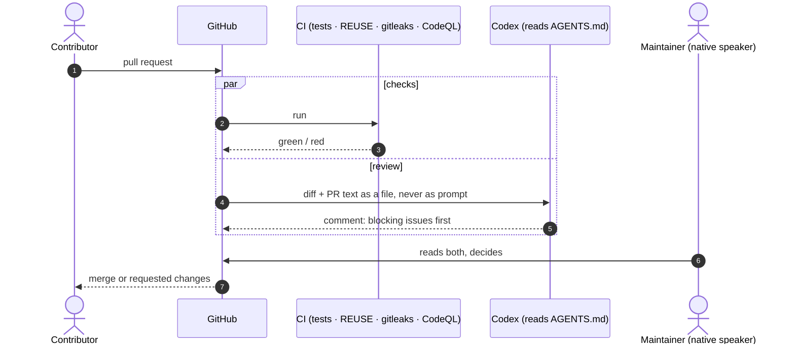

<p align="center">
  
</p>

<h1 align="center">Zmaj – learn Bosnian</h1>

<p align="center"><b>English</b> · <a href="README.bs.md">Bosanski</a></p>

<p align="center">
  <a href="https://github.com/zmaj-lernapp/zmaj/actions/workflows/ci.yml"></a>
  <a href="https://github.com/zmaj-lernapp/zmaj/actions/workflows/codeql.yml"></a>
  <a href="https://scorecard.dev/viewer/?uri=github.com/zmaj-lernapp/zmaj"></a>
  <a href="LICENSE"></a>
  <a href="LICENSE-CONTENT"></a>
  <a href="REUSE.toml"></a>
  <a href="https://zmaj-lernapp.github.io/zmaj/"></a>
</p>

**An offline app for learning Bosnian, and the open Bosnian course behind it.**
65 levels from the first *Merhaba* to an employment contract, 1,728 words with
Bosnian audio, 16 grammar lessons, 12 graded reading stories, an interface in
eight languages. No account and no server: learning progress never leaves the
phone. All of the content is free to reuse as a dataset.

<p align="center">
  
</p>

## Why this exists

Bosnian has a few million speakers and a large diaspora in Germany,
Austria, Scandinavia, Turkey, the Netherlands and France. Children and spouses
in those families often understand Bosnian but cannot speak it. For them there
was little beyond vocabulary lists: mainstream apps do not offer Bosnian, and
open learning material for it is scarce.

> *"I built Zmaj for my wife, because I could not find anything for Bosnian
> that went beyond vocabulary lists."* – Ajdin Hasic, maintainer and native speaker

It grew into a full course. Zmaj teaches **Ijekavian Bosnian** as spoken in Bosnia (*mlijeko, lijep,
vrijeme, kahva*), following Halilović's *Pravopis bosanskoga jezika*, and keeps
the regional variants real families use. The last section covers what people
otherwise need a translator for: the municipality, the bank, the doctor, a
rental or employment contract.

## Try it in 20 seconds

**In the browser:** [zmaj-lernapp.github.io/zmaj](https://zmaj-lernapp.github.io/zmaj/).
No account, no install; the interface follows your browser language. Append
`?alle=1` to unlock every level. The web demo has no ads
([`demo_bauen.py`](demo_bauen.py)); it is hosted by GitHub Pages.

**Locally,** with nothing but Python 3.9+:

```bash
git clone https://github.com/zmaj-lernapp/zmaj.git
cd zmaj
python3 start.py          # opens http://localhost:8000
```

The Android app is in a closed test on Google Play since 23 September 2026;
the public release follows.

## The open dataset

Everything the app teaches is exported to [`data/`](data/) under
**CC BY-SA 4.0**, regenerated and checked on every commit:

| | Count | Formats |
|---|---:|---|
| Words and phrases, 9 sections, 65 levels | 1,728 | JSON, CSV, Anki (8 decks) |
| Cloze sentences with full sentence | 300 | JSON, CSV |
| Graded stories with glossary and questions | 12 | JSON |
| Reading glossary | 406 | JSON |
| Grammar lessons with exercises | 16 | JSON |
| Synthetic Bosnian audio (MP3) | 2,332 | `web/audio/` |
| Parallel corpus for machine translation | 2,040 items × 8 languages | TMX 1.4b, JSONL, TSV pairs |

Every item is translated into **German, English, Turkish, Swedish, Dutch,
Norwegian, Danish and French**. JSON Schemas, a SHA-256 manifest and an honest
[datasheet](data/DATASHEET.md) (how it was made, what is reviewed by native
speakers and what is not) come with it.

```python
import json
vocab = json.load(open("data/vocabulary.json", encoding="utf-8"))
print(vocab["entries"][0]["bs"], vocab["entries"][0]["translations"]["en"])  # Merhaba Hello
```

Uses: flashcards and classroom material, other learning apps, and parallel
phrase pairs plus a pronunciation lexicon for low-resource Bosnian NLP.

## What the app does

- **Lessons** that rotate exercise types: recognise, choose, type, fill the
  gap, listen, speak (with the device's speech recognition).
- **A level test** after each level, with review questions from the levels it
  builds on, and a **review pot** for what you got wrong.
- **Grammar**: cases, verb endings, tenses, word order: 16 lessons, 104 exercises.
- **Reading**: 12 stories, every word tappable, read aloud from start to end.
- **Audio for everything**, shipped with the app, so it works on devices with
  no Bosnian voice and without internet.
- **Eight interface languages**; switching keeps your progress.
- **Private by design**: no account, no analytics, no remote fonts or scripts.
  Progress is stored on the device and can be exported to a file.
- **Funding, openly**: the Google Play build shows ads via Google AdMob behind
  Google's consent dialog, and an optional subscription removes them. Every
  exercise is free; nothing in the course is paywalled. What is sent to whom
  is spelled out in the privacy policy in `sprachen.py`.

## How it is built

One function, `start.lade_daten()`, turns the content files into what every
output needs, so the app, the dataset and the demo can never disagree:



| Path | What |
|---|---|
| `web/index.html` | the whole app: one file of HTML, CSS and JavaScript, no framework, no build step |
| `vokabeln.py`, `grammatik.py`, `geschichten.py` | the course content |
| `uebersetzungen.py`, `sprachen.py` | content translations and interface texts in 8 languages |
| `start.py` | development server; reads the content live |
| `inhalt_bauen.py` | content → `web/inhalt/<lang>.json` for the Android shell |
| `daten_exportieren.py` | content → open dataset in `data/` |
| `tests/` | content, translation, audio, dataset and repository checks |

The Android shell (Capacitor) lives in a separate private repository because
the signing key is next to it. Overview: [`docs/ARCHITECTURE.md`](docs/ARCHITECTURE.md).
Maintainer notes in German:
[`docs/WARTUNG.md`](docs/WARTUNG.md), [`ANLEITUNG.md`](ANLEITUNG.md).

## Quality

Every push runs `pytest` on Python 3.9 and 3.13 (word IDs, cloze gaps,
answers present in every language, placeholders and HTML balanced in all
translations, an audio file for every item, dataset in sync with the
sources), plus `ruff`, REUSE licensing, gitleaks over the full history,
CodeQL and OpenSSF Scorecard. All actions are pinned to commit SHAs.

20 browser tests (Playwright) play the built app like a learner: start in all
eight languages without script errors or requests to other servers, finish a
lesson and a level test, read a story, switch language and keep progress,
survive malicious backup files, and pass axe-core's accessibility checks
(0 serious or critical findings once
[`barrierefreiheit_richten.py`](barrierefreiheit_richten.py) is applied).
Two security reviews are documented in [SECURITY.md](SECURITY.md).

## Working with AI agents

[`AGENTS.md`](AGENTS.md) tells Codex and other agents the rules that are easy
to break here: word IDs are user data, Bosnian text is never translated, a
native speaker overrides any model. Pull requests are reviewed by Codex
against those rules ([workflow](.github/workflows/codex-review.yml)), and a
maintainer can ask Codex for a first look at a reported language error
([workflow](.github/workflows/codex-language-triage.yml)). A human decides in
both cases.



## Contributing

The most valuable help is a **native speaker's eye**: Bosnian, or any of the
eight translation languages, whose non-German versions have not yet been
checked by native speakers. Open a
[language correction](https://github.com/zmaj-lernapp/zmaj/issues/new?template=language_correction.yml);
no git needed. For code, see [CONTRIBUTING.md](CONTRIBUTING.md).

## License

- Code: [AGPL-3.0-or-later](LICENSE)
- Learning content, audio, artwork and documentation: [CC BY-SA 4.0](LICENSE-CONTENT)
- Third-party files keep their licenses (Nunito and Spectral fonts: OFL-1.1, lottie-web: MIT)
- Per-file details in [`REUSE.toml`](REUSE.toml). "Zmaj" and the app icon are
  trademarks; forks are welcome under a different name ([TRADEMARK.md](TRADEMARK.md)).

Please cite as described in [CITATION.cff](CITATION.cff).

---

<details>
<summary><b>Deutsch</b></summary>

**Zmaj** ist eine Offline-App zum Bosnischlernen: 65 Level, 1728 Vokabeln mit
bosnischer Tonspur, 16 Grammatikeinheiten, 12 Lesegeschichten, Oberfläche in
acht Sprachen. Kein Konto, kein Server, der Lernstand bleibt auf dem Gerät.
Der gesamte Lerninhalt steht unter CC BY-SA 4.0 als Datensatz in
[`data/`](data/), der Code unter AGPL-3.0.

Fehler in einem Wort oder einer Übersetzung bitte über
[Sprachkorrektur](https://github.com/zmaj-lernapp/zmaj/issues/new?template=language_correction.yml)
melden. Notizen für den Betrieb: [`docs/WARTUNG.md`](docs/WARTUNG.md).

</details>
