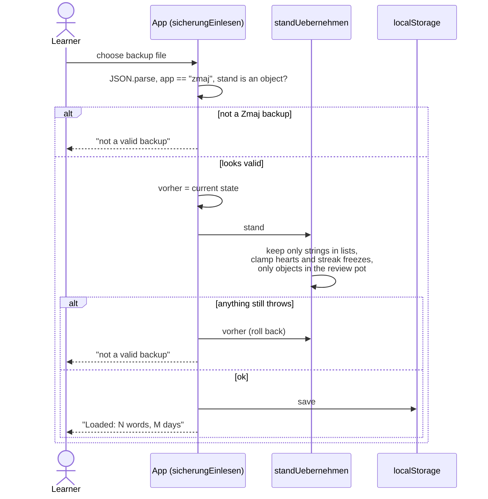

# Security policy

## Supported versions

Only the latest release of the app and the `master` branch receive fixes.

## What matters here

Zmaj has no server and no accounts; learning progress never leaves the
device. The parts that can still go wrong, and that we want to hear about:

- anything that makes the app contact a server it should not, or send more
  than the privacy policy (`sprachen.py`, `set.datenschutz_text`) says;
- script injection through a backup file (Settings → Backup → Import) or
  through content strings rendered as HTML;
- secrets or personal data in this repository or its history;
- a compromised third-party file in `web/` (`lottie.min.js`, fonts).

The one untrusted input is a backup file. This is how the import is guarded
from the first build after the closed test (`import_richten.py`):

Before that fix, a hand-written backup with `"gewusst":[1]` locked the app at
every start. It was found in our own review on 04.10.2026 and is reproduced
and verified in a browser; see the docstring of `import_richten.py`.

## Reporting a vulnerability

Please **do not open a public issue.** Use GitHub's private reporting:
[Report a vulnerability](https://github.com/zmaj-lernapp/zmaj/security/advisories/new),
or write to **zmaj.lernapp@gmail.com** with "Security" in the subject.

You will get an answer within **5 days**. Confirmed issues are fixed in the
next release, normally within 30 days, and you are credited in the release
notes unless you prefer otherwise.

## Reviews so far

| Date | Scope | Result |
|---|---|---|
| 04.10.2026 | backup import | 3 confirmed (lock-out at every start, unlimited hearts, review tab crash); fixed in `import_richten.py` |
| 04.10.2026 | URL parameters, stored settings, HTML sinks, mailto, load paths | nothing exploitable; 2 hardenings in `sicherheit2_richten.py` |

Both fixes are verified in a browser by `tests_e2e/` and ship with the first
build after the closed test on Google Play (07.10.2026).

## What we already do

- CodeQL (`security-extended`) on Python, JavaScript and the workflows, on
  every pull request and weekly.
- gitleaks over the full git history on every push.
- OpenSSF Scorecard, all GitHub Actions pinned to commit SHAs, workflows
  with read-only default permissions.
- The app loads no remote scripts, fonts or analytics; third-party files are
  vendored and listed in `web/LIZENZEN.txt` and `REUSE.toml`.
