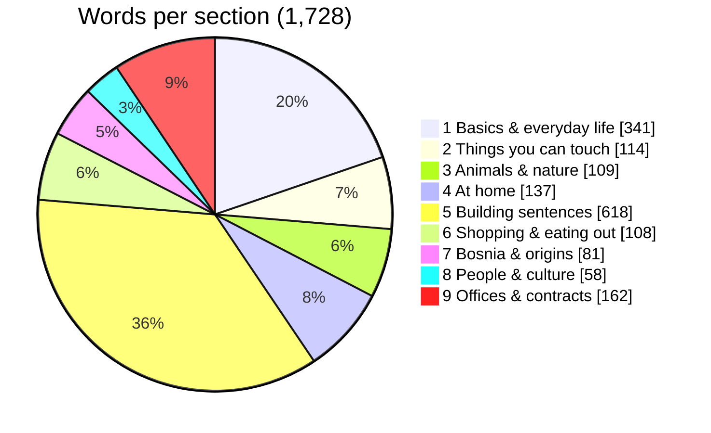
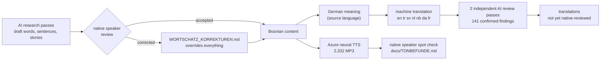

# Datasheet: Zmaj Bosnian learning dataset

An open, structured course for learning **Bosnian** (Ijekavian, Latin script):
vocabulary, cloze sentences, graded reading stories, a reading glossary and
grammar lessons, each translated into eight languages and with a Bosnian
audio recording for every word, sentence and story.

It is the exact content of the Zmaj app, exported by
[`daten_exportieren.py`](../daten_exportieren.py). CI fails if `data/` and the
source files disagree, so this folder is never stale.

| | |
|---|---|
| License | [CC BY-SA 4.0](../LICENSE-CONTENT) |
| Attribution | *Zmaj – Bosnian learning content, © 2026 Ajdin Hasic, CC BY-SA 4.0, https://github.com/zmaj-lernapp/zmaj* |
| Format version | 1.0 (see `manifest.json`) |
| DOI | [10.5281/zenodo.23146609](https://doi.org/10.5281/zenodo.23146609) (all versions, archived on Zenodo) |
| Target language | Bosnian (`bs`) |
| Translation languages | German `de` · English `en` · Turkish `tr` · Swedish `sv` · Dutch `nl` · Norwegian Bokmål `nb` · Danish `da` · French `fr` |

## Contents



| File | What | Count |
|---|---|---|
| `vocabulary.json` / `.csv` | words and phrases, 9 sections, 65 levels | 1,728 |
| `sentences.json` / `.csv` | fill-in-the-gap sentences with the full sentence | 300 |
| `stories.json` | graded stories with translation, glossary and comprehension questions | 12 |
| `glossary.json` | word-by-word reading glossary used by the stories | 406 |
| `grammar.json` | grammar lessons (explanations, tables, exercises) per language | 16 |
| `anki/zmaj-bs-<lang>.tsv` | ready-to-import Anki decks, tagged by level | 8 decks |
| `parallel/bs-<lang>.tsv` | Bosnian–X pairs for machine translation: words, then sentences | 2,028 pairs × 8 |
| `parallel.jsonl` | one line per word, sentence and story with all translations | 2,040 lines |
| `parallel.tmx` | the same as a TMX 1.4b translation memory (`srclang="bs"`) | 2,040 `<tu>` |
| `manifest.json` | counts and SHA-256 of every file above | – |
| `schema/*.schema.json` | JSON Schema (2020-12) for the JSON files and one `parallel.jsonl` line | – |

Audio paths (`web/audio/w0001.mp3` …) are relative to the repository root.
There are 2,332 MP3 files (≈ 37 MB).

## Quick start

```python
import json
vocab = json.load(open("data/vocabulary.json", encoding="utf-8"))
for e in vocab["entries"][:3]:
    print(e["bs"], "→", e["translations"]["en"], e["audio"])
# Merhaba → Hello web/audio/w0001.mp3
```

**Anki:** each [release](https://github.com/zmaj-lernapp/zmaj/releases) has a
`zmaj-bosnian-<lang>.apkg` per language with audio and cards in both
directions (built by [`anki_bauen.py`](../anki_bauen.py)); re-importing a newer
package updates the cards and keeps your review history. Without audio:
File → Import → `data/anki/zmaj-bs-en.tsv` (Anki 2.1.54 or newer).

## For machine translation

The parallel files hold the same content as the course files, flattened into
Bosnian–X pairs. Each TSV has a header `bs  <lang>  kind  id`, no quoting
(no field contains a tab or line break) and skips empty translations:

```text
bs	en	kind	id
Dobro jutro	Good morning	word	guten morgen:Dobro jutro
Gdje je stanica?	Where is the stop?	sentence	s0041
```

`parallel.jsonl` and `parallel.tmx` also contain the 12 stories as whole
texts; they are not sentence-aligned. Words are short phrases, often with
variants separated by ` / ` (*Laku noć / Lahku noć*); split or drop them as
your task requires. With 2,028 pairs per language this is evaluation or
fine-tuning data, not a training corpus, and the translations other than
German are not yet native-reviewed (see below).

## How it was made



**Bosnian text.** Words, sentences and stories were drafted with the help of
AI research passes and then reviewed and corrected by the maintainer, a native
speaker. Every correction is logged in
[`WORTSCHATZ_KORREKTUREN.md`](../WORTSCHATZ_KORREKTUREN.md); where the
native speaker and the research disagree, the native speaker wins. The spelling follows Senahid Halilović,
*Pravopis bosanskoga jezika*; further references are listed in the app under
Settings → Sources. Regional variants are kept where families really use them
(*kahva/kafa*, *babo/otac*, *hiljada/tisuća*).

**Translations.** German is the source language. The seven other languages
were machine-translated and checked by two independent AI review passes; the
[report](../docs/uebersetzungen-pruefbericht-2026-09-18.md) lists 141
confirmed findings, 35 of them wrong meanings. They
have **not yet been reviewed by native speakers**. Corrections are very welcome:
use the *Language correction* issue form.

**Audio.** Synthesised with Azure Neural Text-to-Speech: `bs-BA-GoranNeural`
(2,307 files), `bs-BA-VesnaNeural` (12, story voices) and `hr-HR-SreckoNeural`
(13, where the Bosnian voice mispronounced a word). It is synthetic speech,
not a recording of a person. Known pronunciation issues are documented in
[`docs/TONBEFUNDE.md`](../docs/TONBEFUNDE.md). If you republish the audio, say that it is
synthetic.

## Intended uses

- language-learning apps, flashcards and classroom material for Bosnian;
- heritage-language learners in the diaspora (Germany, Austria, Scandinavia,
  Turkey, the Netherlands, France), which is why these eight languages exist;
- low-resource NLP: parallel phrase pairs, a pronunciation lexicon, evaluation
  data for Bosnian MT and TTS.

## Limitations

- Ijekavian Bosnian only. Ekavian/Serbian or Croatian standard forms appear only
  where the course explains the difference.
- Small by NLP standards; it is a curated course, not a corpus.
- The `id` of a word is `"<german meaning>:<bosnian>"` and is **stable**: the
  app stores progress under it. It is not meant to be read as a translation.
- Non-German translations can contain errors (see above).

## Maintenance

Released together with the app. A change of fields raises `format_version`;
new words do not. Report problems at
https://github.com/zmaj-lernapp/zmaj/issues.
