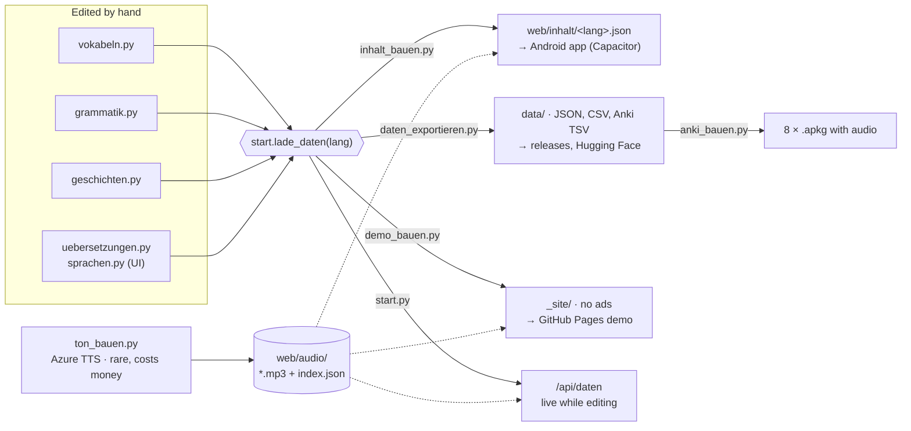
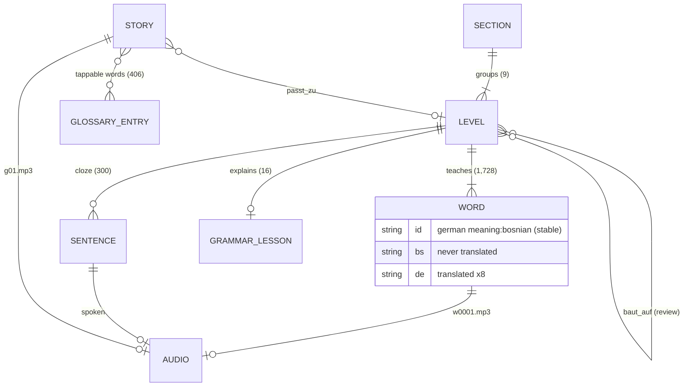
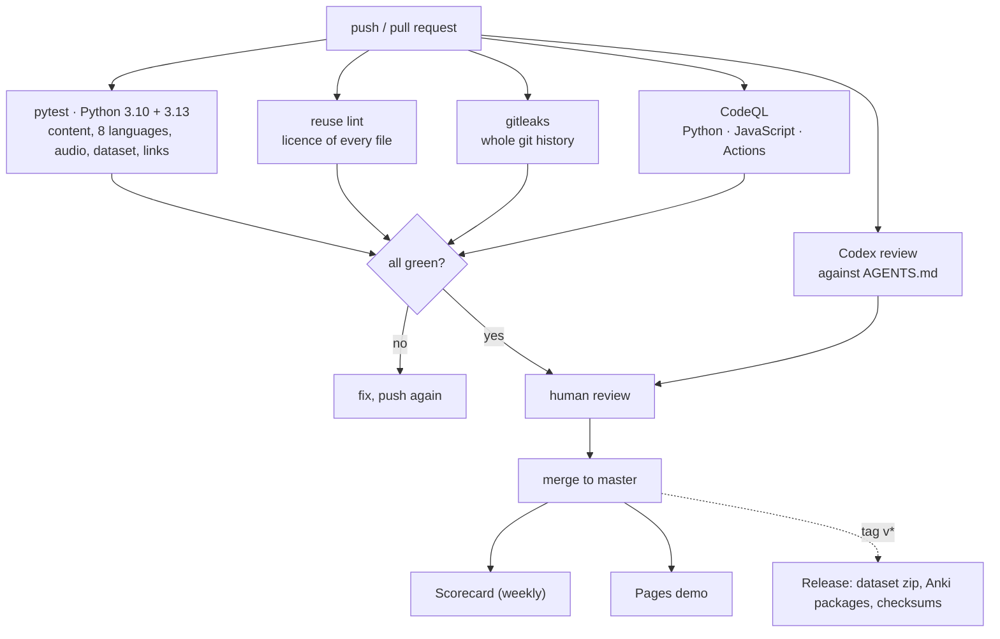

# Architecture

A one-page map for contributors and reviewers. The detailed maintainer manual
is [`ANLEITUNG.md`](../ANLEITUNG.md) (German).

## The idea

One HTML file is the whole app. The learning content lives in Python data
files because they are easy to edit, comment and review. A few scripts turn
that content into JSON for the app, into the open dataset, into Anki decks and
into a web demo. There is no server in production and no build step for the
app itself.

`start.lade_daten(lang)` is the single source of truth: the development
server, `inhalt_bauen.py`, `daten_exportieren.py` and `demo_bauen.py` all call
it, so the phone, the dataset and the demo can never disagree.

## Content model

| Concept | Where | Notes |
|---|---|---|
| Section | `vokabeln.SEKTIONEN` | 9 sections group the levels on the learning path |
| Level | `vokabeln.KATEGORIEN` | order in the list = level number; `baut_auf` names earlier levels whose words the level test reviews |
| Word | `{"de": …, "bs": …}` inside a level | ID = `"<german meaning lowercased>:<bosnian>"`, computed in `start.mit_kennung()` |
| Cloze sentence | `vokabeln.SAETZE` | `___` is the gap, `answer` fills it, `kat` is the level |
| Grammar lesson | `grammatik.GRAMMATIK[level_id]` | explanation (text and tables) + multiple-choice exercises |
| Story | `geschichten.GESCHICHTEN` | text, translation, glossary, questions; `WOERTERBUCH` makes every word tappable |
| Translation | `uebersetzungen.py` | German is the source; the other seven languages map German strings to theirs. Bosnian is never translated |
| UI text | `sprachen.TEXTE[lang][key]` | 488 keys × 8 languages, including the legal texts |

**Word IDs are user data.** Learning progress is stored under them. Changing
the German meaning of an existing word creates a new ID and resets that word
for every learner. See [`AGENTS.md`](../AGENTS.md).

## The app (`web/index.html`)

Plain JavaScript, no framework. Main parts, in file order:

- **Settings and switches**: `WERBUNG_AN`, `WERBUNG_ECHT`, test constants.
- **Storage**: everything in `localStorage` under `zmaj_*` keys, every access
  in `try` so private windows still work. `zmaj_stand` holds the whole progress
  (known word IDs, passed levels, learning days, lives, coins, items).
- **Content loading** (`holeInhalt`): first `/api/daten` (the dev server),
  then `inhalt/<lang>.json`, then English, then German.
- **Lesson engine** (`buildLesson`, `renderTask`): mixes new-word cards,
  multiple choice in both directions, typing, listening, speaking (device
  speech recognition), cloze and grammar tasks. Wrong answers go to the
  review pot (`topf`).
- **Level test** (`buildTest`): 10 questions, 3 of them review from `baut_auf`;
  8 right opens the next level.
- **Stories** (`openStory`): tap a word for its gloss, play the whole story.
- **Audio** (`audioDatei`): looks up `web/audio/index.json` by full text, first
  form, then without punctuation; falls back to the device's TTS.
- **Mascot**: a Lottie animation generated by `zmaj_lottie.py`, recoloured and
  dressed at runtime.
- **Ads and subscription**: only inside the Android shell, through Capacitor
  plugins: AdMob behind Google's consent dialog (`ZmajEinwilligung`), the
  subscription through the shell's own `ZmajAbo` plugin for Google Play.
  In a browser no ad network exists; `demo_bauen.py` switches ads off
  completely for the public demo.

## Android

A separate private repository wraps `web/` with Capacitor (`app_bauen.py`
copies it and runs `cap sync`). The package name `de.smartdragon.zmaj` and the
WebView origin `https://localhost` must never change: the first is the Play
Store identity, the second is the origin that owns the learners' stored
progress.

## Quality gates

| Check | Tool | Where |
|---|---|---|
| Content integrity in all 8 languages | `pytest` (`tests/`) | CI, Python 3.10 and 3.13 |
| App content builds and all UI keys exist | `inhalt_bauen.py`, `texte_pruefen.py` | CI |
| Dataset matches the sources | `daten_exportieren.py --pruefen` | CI and a test |
| Lint | `ruff` | CI |
| Licensing of every file | `reuse lint` | CI |
| Secrets in history | gitleaks | CI |
| Security analysis | CodeQL (Python, JavaScript, Actions) | CI, weekly |
| Supply chain | OpenSSF Scorecard, SHA-pinned actions, hash-locked dev tools | CI, weekly |
| Review | Codex against `AGENTS.md`, then a human | every pull request (when secret `OPENAI_API_KEY` and variable `CODEX_AN=true` are set) |
